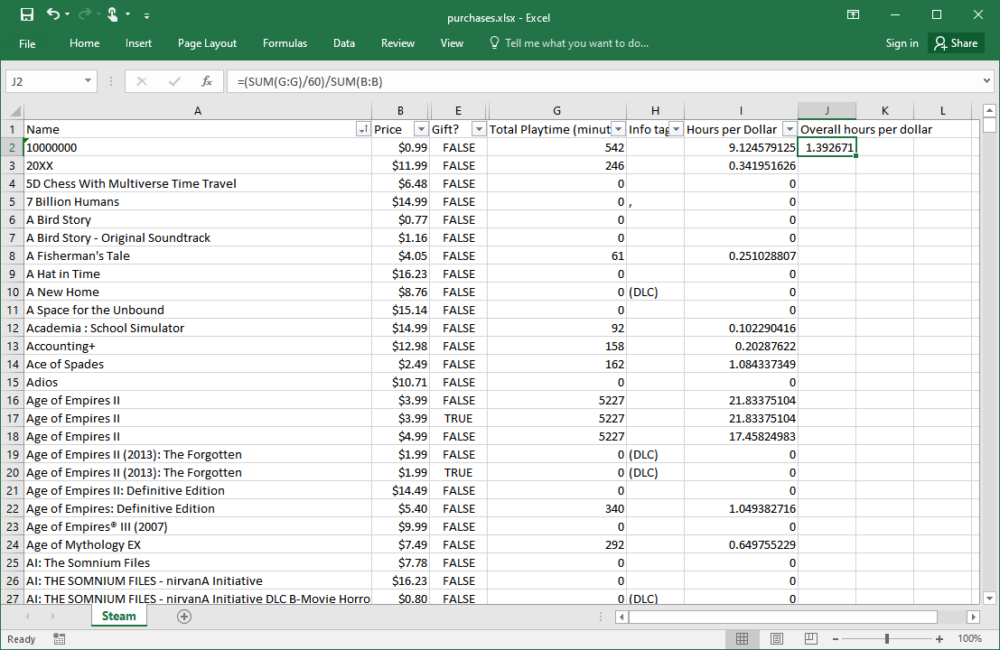

# It's The Program

It's The Program scans your Steam purchase history and library playtime and creates a spreadsheet, so you can compare the price you paid (including any discounts!) with the amount of playtime you've gotten.

For Electronic Game Information.

## Security disclaimer

Because this program needs access to your Steam receipts, you'll need to log in and give it full account access. ***Never do this.*** This kind of user-agent login has the potential to give attackers and scammers full access to your Steam account, including your payment infomation and item library, and could do irrevocable damage!

You should only run this program if you're confident that it does not send your information anywhere and does not do anything with it you don't want (the code is short and relatively readable, and it's read-only), but you probably shouldn't do it at all. 

## Usage

Requires firefox. 

Run the program and log in with the selenium browser. It will use your session information and scrape your purchase history, then create a spreadsheet.

## Example

<!--

## Submission note

Robby: 

I was watching your show and when you talked about your spreadsheet I was disappointed, because I haven’t kept all my receipts so I don’t know what price I paid for my games. But then I realized steam saves all that data, including what are you got on sale. So I made a program that makes a spreadsheet from your Steam data

I’m not advising anyone to run this because on principle you should give your Steam credentials to strange programs on the Internet, but I wanted to show off my work and maybe this can help some spreadsheet fans who can read the code and understand what it’s doing.

-->
